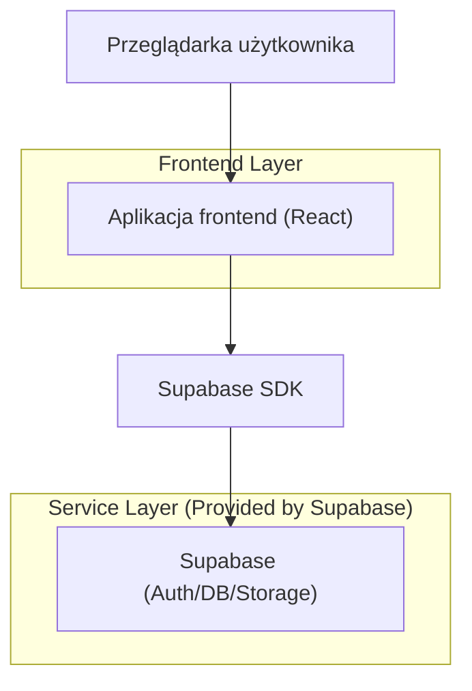
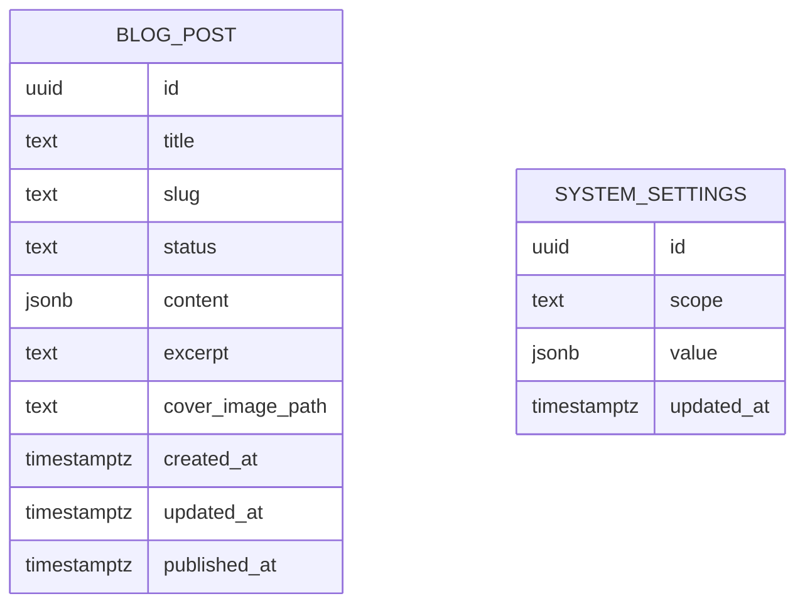

## 1.Architecture design


## 2.Technology Description
- Frontend: React@18 + TypeScript + vite + tailwindcss@3
- Backend: Supabase (PostgreSQL + Storage + opcjonalnie Auth)

## 3.Route definitions
| Route | Purpose |
|-------|---------|
| / | Pulpit (launcher i okna aplikacji) |
| /settings | Ustawienia systemu (motywy, dźwięki, tekst/czytelność) |
| /blog | Lista wpisów bloga |
| /blog/new | Nowy wpis (WYSIWYG) |
| /blog/:id | Szczegóły wpisu |
| /blog/:id/edit | Edycja wpisu (WYSIWYG) |

## 6.Data model(if applicable)

### 6.1 Data model definition


### 6.2 Data Definition Language
Blog posts (blog_posts)
```
CREATE TABLE blog_posts (
  id UUID PRIMARY KEY DEFAULT gen_random_uuid(),
  title TEXT NOT NULL,
  slug TEXT UNIQUE,
  status TEXT NOT NULL DEFAULT 'draft',
  content JSONB NOT NULL DEFAULT '{}'::jsonb,
  excerpt TEXT,
  cover_image_path TEXT,
  created_at TIMESTAMPTZ NOT NULL DEFAULT NOW(),
  updated_at TIMESTAMPTZ NOT NULL DEFAULT NOW(),
  published_at TIMESTAMPTZ
);

CREATE INDEX idx_blog_posts_status ON blog_posts(status);
CREATE INDEX idx_blog_posts_published_at ON blog_posts(published_at DESC);
```

System settings (system_settings)
```
CREATE TABLE system_settings (
  id UUID PRIMARY KEY DEFAULT gen_random_uuid(),
  scope TEXT NOT NULL, -- np. 'global' albo identyfikator użytkownika, jeśli kiedyś dojdzie Auth
  value JSONB NOT NULL DEFAULT '{}'::jsonb,
  updated_at TIMESTAMPTZ NOT NULL DEFAULT NOW()
);

CREATE UNIQUE INDEX ux_system_settings_scope ON system_settings(scope);
```

Minimalne uprawnienia (RLS/GRANT) – przykład podejścia
```
-- anon: tylko odczyt publicznych postów (jeśli blog ma być publiczny)
GRANT SELECT ON blog_posts TO anon;

-- authenticated: pełna edycja (jeśli edycja ma być ograniczona)
GRANT ALL PRIVILEGES ON blog_posts TO authenticated;
GRANT ALL PRIVILEGES ON system_settings TO authenticated;
```