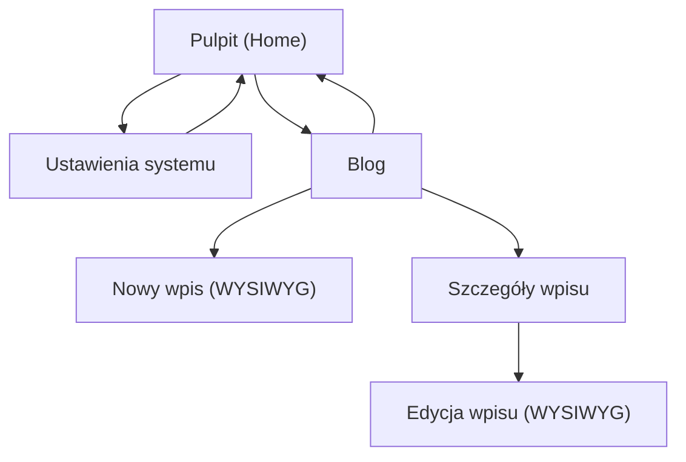

## 1. Product Overview
GAIOS to webowy „system” z pulpitem i aplikacjami, który ma działać płynnie jak prawdziwy OS.
Celem ulepszeń jest poprawa czytelności (łamanie tekstu), rozbudowa aplikacji, nowe motywy, edytor WYSIWYG bloga oraz więcej ustawień i dźwięków.

## 2. Core Features

### 2.1 Feature Module
Wymagania obejmują następujące kluczowe strony:
1. **Pulpit (Home)**: uruchamianie aplikacji, okna/apki, lepsze łamanie tekstu w UI, szybki dostęp do motywów i ustawień.
2. **Ustawienia systemu**: motywy, dźwięki, ustawienia wyświetlania/tekstu, konfiguracja zachowania systemu.
3. **Blog**: lista wpisów, szczegóły wpisu, edytor WYSIWYG (tworzenie/edycja), publikacja i podgląd.

### 2.3 Page Details
| Page Name | Module Name | Feature description |
|-----------|-------------|---------------------|
| Pulpit (Home) | Launcher aplikacji | Otwierać istniejące aplikacje; grupować je w siatce/kafelkach; zapamiętywać ostatnio używane. |
| Pulpit (Home) | Zarządzanie oknami aplikacji | Otwierać/zamykać/minimalizować; utrzymywać spójne paski tytułu; obsługiwać przewijanie treści w oknach. |
| Pulpit (Home) | Lepsze łamanie tekstu w UI | Zawijać tekst w kartach/oknach bez „rozjeżdżania” layoutu; poprawnie łamać długie słowa/URL; zachować czytelne odstępy i hyphenation (jeśli dostępne). |
| Pulpit (Home) | Skróty do personalizacji | Udostępniać szybkie przejście do zmiany motywu i dźwięków (np. z docka/menubar). |
| Ustawienia systemu | Motywy (nowe + istniejące) | Przeglądać listę motywów; podejrzeć; zastosować; cofnąć do poprzedniego; ustawić domyślny motyw. |
| Ustawienia systemu | Dźwięki systemowe | Wybierać paczkę dźwięków; odsłuchiwać próbki; regulować głośność; włączać/wyłączać dźwięki wybranych zdarzeń. |
| Ustawienia systemu | Ustawienia tekstu i czytelności | Zmieniać rozmiar UI/tekstów; sterować zachowaniem łamania (np. zawijanie vs ucinanie); testować w podglądzie. |
| Ustawienia systemu | Pozostałe ustawienia systemu | Konfigurować zachowania systemu (np. animacje, powiadomienia) w jednej, spójnej strukturze sekcji. |
| Blog | Lista i nawigacja wpisów | Wyświetlać listę wpisów; filtrować/podstawowo sortować; przechodzić do szczegółów i edycji. |
| Blog | WYSIWYG edytor wpisu | Tworzyć/edytować treść w trybie WYSIWYG; formatować (nagłówki, akapity, linki, listy); wstawiać obrazy; zapisywać wersję roboczą. |
| Blog | Podgląd i publikacja | Pokazywać podgląd wpisu; publikować; aktualizować opublikowany wpis; potwierdzać operacje i błędy. |

## 3. Core Process
- Personalizacja: na Pulpicie przechodzisz do Ustawień, wybierasz motyw oraz paczkę dźwięków, testujesz podgląd i zapisujesz.
- Czytelność: w Ustawieniach zmieniasz parametry tekstu (np. rozmiar, zawijanie/ucinanie), a następnie wracasz na Pulpit, aby zobaczyć efekt w oknach i kartach.
- Blogowanie: wchodzisz do Bloga, tworzysz nowy wpis w edytorze WYSIWYG, dodajesz formatowanie i obrazy, uruchamiasz podgląd i publikujesz.

